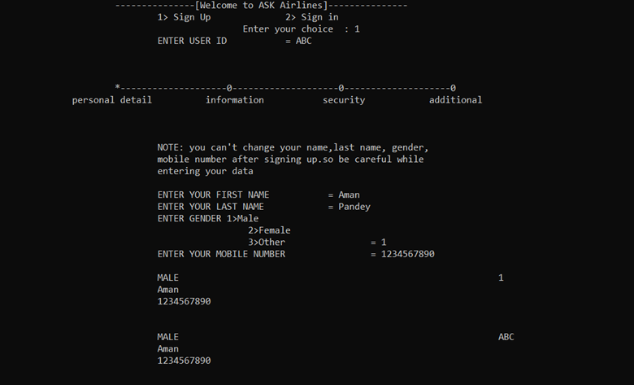

# Flight-Booking-System-in-Java
A console-based Java application for Airlines, providing functionalities for user registration, authentication, flight booking, check-in, flight management, and account management. Designed to offer a seamless and user-friendly experience for managing airline services.

## Features

- **User Authentication:**
  - Sign Up with personal and security details.
  - Sign In with user ID and password.
  
- **Flight Booking:**
  - Select departure and arrival airports.
  - Generate PNR (Passenger Name Record) for bookings.
  
- **Check-In:**
  - Enter flight code and seat number to generate boarding pass.
  
- **Manage Flight:**
  - View flight facilities.
  - Cancel existing bookings.
  
- **Account Management:**
  - Change password and user ID.
  - Log out of the system.
  
- **Additional Information:**
  - View information about ASK Airlines.
  - Access contact details and rules.

## Screenshot

